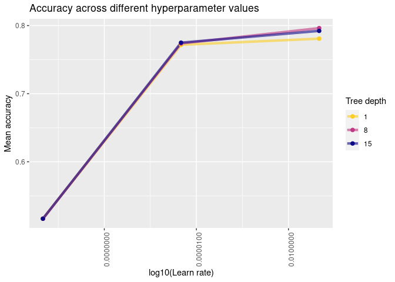
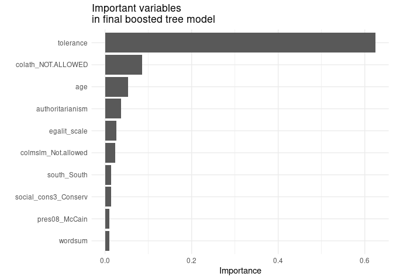

Predicting Attitudes Towards Racist College Professors
================
Julia Du
2021-02-28

  - [Load necessary libraries](#load-necessary-libraries)
  - [Logistic regression](#logistic-regression)
  - [Random forest](#random-forest)
  - [5-nearest neighbors](#5-nearest-neighbors)
  - [Ridge logistic regression](#ridge-logistic-regression)
  - [Tuned boosted tree](#tuned-boosted-tree)
  - [Comparing models](#comparing-models)
  - [Session info](#session-info)

## Load necessary libraries

``` r
library(tidyverse)
library(tidymodels)
library(rcfss)
library(usemodels)
library(kknn)
library(glmnet)
library(xgboost)
library(vip)
library(lubridate)

# load correct gss data frame
data("gss", package = "rcfss")

theme_set(theme_minimal())
```

``` r
# setting seed for all of this doc
set.seed(123)

# splitting data
gss_split <- initial_split(gss, strata = colrac)

gss_train <- training(gss_split)
gss_test <- testing(gss_split)

folds <- vfold_cv(gss_train, v = 10)
```

## Logistic regression

``` r
# build a log model specification
lr_mod <- logistic_reg() %>% 
  set_engine("glm")

# resample via a workflow
colrac_lr_wf <- workflow() %>%
  add_model(lr_mod) %>%
  add_formula(colrac ~ 
                age + black + degree + partyid_3 + sex + south)

lr_fit_rs <- colrac_lr_wf %>%
  fit_resamples(folds)

lr_fit_rs %>%
  collect_metrics() %>%
  filter(.metric == "accuracy")
```

    ## # A tibble: 1 x 6
    ##   .metric  .estimator  mean     n std_err .config             
    ##   <chr>    <chr>      <dbl> <int>   <dbl> <chr>               
    ## 1 accuracy binary     0.530    10  0.0134 Preprocessor1_Model1

## Random forest

``` r
# random forest template  
# doesn't actually do anything, but good for reference
#use_ranger(colrac  ~ ., data = gss_train, verbose = TRUE, tune = FALSE)

# build a random forest model specification
rf_mod <- rand_forest(trees = 1000) %>% 
  set_engine("ranger") %>% 
  set_mode("classification")

rf_rec <- recipe(colrac ~ ., data = gss_train) %>% 
  update_role(id, wtss, new_role = "ID") %>%
  step_naomit(colrac, skip = TRUE) %>%
  step_medianimpute(all_numeric()) %>%
  step_modeimpute(all_nominal(), -all_outcomes()) %>%
  step_cut(cohort, breaks = c(1945, 1964, 1980))

rf_wf <- workflow() %>%
  add_model(rf_mod) %>%
  add_recipe(rf_rec)

rf_rs <- rf_wf %>%
  fit_resamples(folds) 

rf_rs %>%
  collect_metrics() %>% 
  filter(.metric == "accuracy")
```

    ## # A tibble: 1 x 6
    ##   .metric  .estimator  mean     n std_err .config             
    ##   <chr>    <chr>      <dbl> <int>   <dbl> <chr>               
    ## 1 accuracy binary     0.795    10 0.00878 Preprocessor1_Model1

## 5-nearest neighbors

``` r
# template for kknn
#use_kknn(colrac ~ ., data = gss_train, verbose = TRUE, tune = FALSE)

knn_mod <- nearest_neighbor(neighbors = 5) %>%              
  set_engine("kknn") %>%             
  set_mode("classification")      

knn_rec <- recipe(formula = colrac ~ ., data = gss_train) %>% 
  update_role(id, wtss, new_role = "ID") %>%
  step_naomit(colrac, skip = TRUE) %>%
  step_medianimpute(all_numeric()) %>%
  step_modeimpute(all_nominal(), -all_outcomes()) %>%
  step_cut(cohort, breaks = c(1945, 1964, 1980)) %>%
  step_novel(all_nominal(), -all_outcomes()) %>%
  step_dummy(all_nominal(), -all_outcomes()) %>%
  step_zv(all_predictors()) %>% 
  step_normalize(all_predictors(), -all_nominal()) 

knn_wf <- workflow() %>%
  add_model(knn_mod) %>%
  add_recipe(knn_rec)

knn_rs <- knn_wf %>%
  fit_resamples(folds) 

knn_rs %>%
  collect_metrics() %>%
  filter(.metric == "accuracy")
```

    ## # A tibble: 1 x 6
    ##   .metric  .estimator  mean     n std_err .config             
    ##   <chr>    <chr>      <dbl> <int>   <dbl> <chr>               
    ## 1 accuracy binary     0.606    10  0.0157 Preprocessor1_Model1

## Ridge logistic regression

``` r
ridge_mod <- logistic_reg(penalty = .01, mixture = 0) %>% 
  set_engine("glmnet") %>% # use glmnet over glm since we have a penalty
  set_mode("classification")

# using same recipe as knn
ridge_rs <- update_model(knn_wf, ridge_mod) %>%
  fit_resamples(folds) 

ridge_rs %>%
  collect_metrics() %>%
  filter(.metric == "accuracy")
```

    ## # A tibble: 1 x 6
    ##   .metric  .estimator  mean     n std_err .config             
    ##   <chr>    <chr>      <dbl> <int>   <dbl> <chr>               
    ## 1 accuracy binary     0.781    10 0.00836 Preprocessor1_Model1

## Tuned boosted tree

``` r
boost_tune_spec <- 
  boost_tree(
  #  min_n = tune(),
    tree_depth = tune(), 
    learn_rate = tune()
  ) %>% 
  set_engine("xgboost") %>% 
  set_mode("classification")

boost_grid <- grid_regular(#min_n(),
                          tree_depth(),
                          learn_rate(),
                          levels = 3)
# originally included min_n() in hyperparameters,
# but was unable to knit on MACSS R server 

boost_wf <- workflow() %>%
  add_model(boost_tune_spec) %>%
  add_recipe(knn_rec)

boost_res <- boost_wf %>% 
  tune_grid(
    resamples = folds,
    grid = boost_grid
    )

boost_res %>%
  collect_metrics() %>%
  filter(.metric == "accuracy")
```

    ## # A tibble: 9 x 8
    ##   tree_depth   learn_rate .metric .estimator  mean     n std_err .config        
    ##        <int>        <dbl> <chr>   <chr>      <dbl> <int>   <dbl> <chr>          
    ## 1          1 0.0000000001 accura… binary     0.516    10 0.0133  Preprocessor1_…
    ## 2          8 0.0000000001 accura… binary     0.516    10 0.0133  Preprocessor1_…
    ## 3         15 0.0000000001 accura… binary     0.516    10 0.0133  Preprocessor1_…
    ## 4          1 0.00000316   accura… binary     0.772    10 0.00945 Preprocessor1_…
    ## 5          8 0.00000316   accura… binary     0.774    10 0.0101  Preprocessor1_…
    ## 6         15 0.00000316   accura… binary     0.775    10 0.0101  Preprocessor1_…
    ## 7          1 0.1          accura… binary     0.781    10 0.00936 Preprocessor1_…
    ## 8          8 0.1          accura… binary     0.796    10 0.0105  Preprocessor1_…
    ## 9         15 0.1          accura… binary     0.792    10 0.0157  Preprocessor1_…

``` r
boost_res %>%
  collect_metrics() %>%
  filter(.metric == "accuracy") %>%
  mutate(tree_depth = factor(tree_depth)) %>%
  ggplot(aes(learn_rate, mean, color = tree_depth)) +
  geom_line(size = 1.5, alpha = 0.6) +
  geom_point(size = 2) +
 # facet_wrap(~ min_n, labeller = label_both) +
  scale_color_viridis_d(option = "plasma", begin = .9, end = 0) +
  scale_x_log10(labels = scales::label_number()) +
  theme(axis.text.x = element_text(angle = 90)) +
  labs(title = "Accuracy across different hyperparameter values",
       x = "log10(Learn rate)",
       y = "Mean accuracy" ,
       color = "Tree depth"
       )
```

<!-- -->

Note: for my tuned boosted tree model, I’d originally included min\_n as
one of the hyperparameters, but I was forced to leave it out because the
MACSS R server was unable to knit with so many hyperparameters. While I
managed to run the code & get my specified output with 3 hyperparametrs,
knitting didn’t work. I’ve left my original code of 3 hyperparameters as
comments, in case you’re curious and want to try it out on your own
computer.

From the graph, we can see that a tree depth of 8 & log10(learn rate) of
around .01 gave the best accuracy of all tested boosted tree models.

``` r
# then choose the best model to finish tuning
best_boost <- boost_res %>%
  select_best("accuracy")

best_boost %>%
  select(-.config) %>%
  knitr::kable(
    caption = "Hyperparameter values maximizing accuracy in boosted tree model", 
    col.names = c(
  #    "Minimum n to split at node",
      "Tree depth", 
      "Learning rate"))
```

| Tree depth | Learning rate |
| ---------: | ------------: |
|          8 |           0.1 |

Hyperparameter values maximizing accuracy in boosted tree model

``` r
final_boost_wf <- boost_wf %>%
  finalize_workflow(best_boost)

# fit best model to training data
final_boost <- final_boost_wf %>%
  fit(data = gss_train)
```

    ## [14:15:00] WARNING: amalgamation/../src/learner.cc:1061: Starting in XGBoost 1.3.0, the default evaluation metric used with the objective 'binary:logistic' was changed from 'error' to 'logloss'. Explicitly set eval_metric if you'd like to restore the old behavior.

``` r
# can see how important each var is here
final_boost %>% 
  pull_workflow_fit() %>% 
  vip() +
  labs(title = "Important variables\nin final boosted tree model") 
```

<!-- -->

``` r
# last fit & eval of model performance
final_fit <- final_boost_wf %>%
  last_fit(gss_split) 

final_fit %>%
  collect_metrics() %>%
  filter(.metric == "accuracy")
```

    ## # A tibble: 1 x 4
    ##   .metric  .estimator .estimate .config             
    ##   <chr>    <chr>          <dbl> <chr>               
    ## 1 accuracy binary         0.804 Preprocessor1_Model1

The importance graph shows which variables are most important in driving
predictions on the racist college professors question for this model -
tolerance seems especially important, which seems logical.

## Comparing models

``` r
# writing function
find_accuracy <- function(df, modeltype) {
  df %>%
  collect_metrics %>%
    filter(.metric == "accuracy") %>%
    add_column(type = modeltype) %>%
    select(c(type, mean)) 
}

# assembling table of all accuracy figures
compare_accuracy <- final_fit %>%
  collect_metrics() %>%
  filter(.metric == "accuracy") %>%
  rename(mean = .estimate) %>%
  add_column(type = "boosted tree") %>%
  select(c(type, mean)) %>%
  bind_rows(
    find_accuracy(lr_fit_rs, "logistic"),
    find_accuracy(rf_rs, "random forest"), 
    find_accuracy(knn_rs, "knn"), 
    find_accuracy(ridge_rs, "ridge logistic")
    ) %>%
  arrange(desc(mean)) 

compare_accuracy %>%
  mutate(mean = mean * 100) %>%
  knitr::kable(
    caption = "Accuracy across models", 
    col.names = c(
      "Model type",
      "Percentage of data predicted correctly"), 
    digits = 3)
```

| Model type     | Percentage of data predicted correctly |
| :------------- | -------------------------------------: |
| boosted tree   |                                 80.428 |
| random forest  |                                 79.499 |
| ridge logistic |                                 78.092 |
| knn            |                                 60.638 |
| logistic       |                                 53.044 |

Accuracy across models

After reducing down to only 2 hyperparameters, the tuned boosted tree
model did the best overall, with a mean accuracy of 80%.

Random forest also gave a quite accurate model, predicting about 79% of
data correctly. The logistic regression did the worst (53% accuracy),
probably because it, unlike all other models built here, didn’t use all
variables in the dataset as predictor variables. The logistic regression
only used the age, black, degree, partyid\_3, sex, and south variables
as predictors - so less of the variation in the outcome variable
would’ve been explained.

All these accuracy figures seem quite reasonable - they aren’t overly
optimistic, which could imply overfitting the data. Instead, they mostly
hover around the upper 70% range, with the basic logistic model doing
poorly due to only using a few predictor variables & the 5-nearest
neighbors underperforming (with an accuracy of 61%) in comparison to the
other models that used all available variables as predictors.

## Session info

``` r
devtools::session_info()
```

    ## ─ Session info ───────────────────────────────────────────────────────────────
    ##  setting  value                               
    ##  version  R version 4.0.1 (2020-06-06)        
    ##  os       Red Hat Enterprise Linux 8.3 (Ootpa)
    ##  system   x86_64, linux-gnu                   
    ##  ui       X11                                 
    ##  language (EN)                                
    ##  collate  en_US.UTF-8                         
    ##  ctype    en_US.UTF-8                         
    ##  tz       America/Chicago                     
    ##  date     2021-02-28                          
    ## 
    ## ─ Packages ───────────────────────────────────────────────────────────────────
    ##  package     * version    date       lib source                        
    ##  assertthat    0.2.1      2019-03-21 [2] CRAN (R 4.0.1)                
    ##  backports     1.2.1      2020-12-09 [2] CRAN (R 4.0.1)                
    ##  broom       * 0.7.3      2020-12-16 [2] CRAN (R 4.0.1)                
    ##  callr         3.5.1      2020-10-13 [2] CRAN (R 4.0.1)                
    ##  cellranger    1.1.0      2016-07-27 [2] CRAN (R 4.0.1)                
    ##  class         7.3-17     2020-04-26 [2] CRAN (R 4.0.1)                
    ##  cli           2.2.0      2020-11-20 [2] CRAN (R 4.0.1)                
    ##  codetools     0.2-16     2018-12-24 [2] CRAN (R 4.0.1)                
    ##  colorspace    2.0-0      2020-11-11 [2] CRAN (R 4.0.1)                
    ##  crayon        1.3.4      2017-09-16 [2] CRAN (R 4.0.1)                
    ##  data.table    1.13.6     2020-12-30 [2] CRAN (R 4.0.1)                
    ##  DBI           1.1.0      2019-12-15 [2] CRAN (R 4.0.1)                
    ##  dbplyr        2.0.0      2020-11-03 [2] CRAN (R 4.0.1)                
    ##  desc          1.2.0      2018-05-01 [2] CRAN (R 4.0.1)                
    ##  devtools      2.3.2      2020-09-18 [1] CRAN (R 4.0.1)                
    ##  dials       * 0.0.9      2020-09-16 [2] CRAN (R 4.0.1)                
    ##  DiceDesign    1.8-1      2019-07-31 [2] CRAN (R 4.0.1)                
    ##  digest        0.6.27     2020-10-24 [2] CRAN (R 4.0.1)                
    ##  dplyr       * 1.0.2      2020-08-18 [2] CRAN (R 4.0.1)                
    ##  ellipsis      0.3.1      2020-05-15 [2] CRAN (R 4.0.1)                
    ##  evaluate      0.14       2019-05-28 [2] CRAN (R 4.0.1)                
    ##  fansi         0.4.1      2020-01-08 [2] CRAN (R 4.0.1)                
    ##  farver        2.0.3      2020-01-16 [2] CRAN (R 4.0.1)                
    ##  forcats     * 0.5.0      2020-03-01 [2] CRAN (R 4.0.1)                
    ##  foreach       1.5.1      2020-10-15 [2] CRAN (R 4.0.1)                
    ##  fs            1.5.0      2020-07-31 [2] CRAN (R 4.0.1)                
    ##  furrr         0.2.1      2020-10-21 [2] CRAN (R 4.0.1)                
    ##  future        1.21.0     2020-12-10 [2] CRAN (R 4.0.1)                
    ##  generics      0.1.0      2020-10-31 [2] CRAN (R 4.0.1)                
    ##  ggplot2     * 3.3.3      2020-12-30 [2] CRAN (R 4.0.1)                
    ##  glmnet      * 4.1-1      2021-02-21 [1] CRAN (R 4.0.1)                
    ##  globals       0.14.0     2020-11-22 [2] CRAN (R 4.0.1)                
    ##  glue          1.4.2      2020-08-27 [2] CRAN (R 4.0.1)                
    ##  gower         0.2.2      2020-06-23 [2] CRAN (R 4.0.1)                
    ##  GPfit         1.0-8      2019-02-08 [2] CRAN (R 4.0.1)                
    ##  gridExtra     2.3        2017-09-09 [2] CRAN (R 4.0.1)                
    ##  gtable        0.3.0      2019-03-25 [2] CRAN (R 4.0.1)                
    ##  hardhat       0.1.5      2020-11-09 [2] CRAN (R 4.0.1)                
    ##  haven         2.3.1      2020-06-01 [2] CRAN (R 4.0.1)                
    ##  highr         0.8        2019-03-20 [2] CRAN (R 4.0.1)                
    ##  hms           0.5.3      2020-01-08 [2] CRAN (R 4.0.1)                
    ##  htmltools     0.5.1.1    2021-01-22 [1] CRAN (R 4.0.1)                
    ##  httr          1.4.2      2020-07-20 [2] CRAN (R 4.0.1)                
    ##  igraph        1.2.6      2020-10-06 [2] CRAN (R 4.0.1)                
    ##  infer       * 0.5.3      2020-07-14 [2] CRAN (R 4.0.1)                
    ##  ipred         0.9-9      2019-04-28 [2] CRAN (R 4.0.1)                
    ##  iterators     1.0.13     2020-10-15 [2] CRAN (R 4.0.1)                
    ##  jsonlite      1.7.2      2020-12-09 [2] CRAN (R 4.0.1)                
    ##  kknn        * 1.3.1      2016-03-26 [1] CRAN (R 4.0.1)                
    ##  knitr         1.30       2020-09-22 [2] CRAN (R 4.0.1)                
    ##  labeling      0.4.2      2020-10-20 [2] CRAN (R 4.0.1)                
    ##  lattice       0.20-41    2020-04-02 [2] CRAN (R 4.0.1)                
    ##  lava          1.6.8.1    2020-11-04 [2] CRAN (R 4.0.1)                
    ##  lhs           1.1.1      2020-10-05 [2] CRAN (R 4.0.1)                
    ##  lifecycle     0.2.0      2020-03-06 [2] CRAN (R 4.0.1)                
    ##  listenv       0.8.0      2019-12-05 [2] CRAN (R 4.0.1)                
    ##  lubridate   * 1.7.9.2    2020-11-13 [2] CRAN (R 4.0.1)                
    ##  magrittr      2.0.1      2020-11-17 [2] CRAN (R 4.0.1)                
    ##  MASS          7.3-51.6   2020-04-26 [2] CRAN (R 4.0.1)                
    ##  Matrix      * 1.2-18     2019-11-27 [2] CRAN (R 4.0.1)                
    ##  memoise       1.1.0      2017-04-21 [2] CRAN (R 4.0.1)                
    ##  modeldata   * 0.1.0      2020-10-22 [2] CRAN (R 4.0.1)                
    ##  modelr        0.1.8      2020-05-19 [2] CRAN (R 4.0.1)                
    ##  munsell       0.5.0      2018-06-12 [2] CRAN (R 4.0.1)                
    ##  nnet          7.3-14     2020-04-26 [2] CRAN (R 4.0.1)                
    ##  parallelly    1.22.0     2020-12-13 [2] CRAN (R 4.0.1)                
    ##  parsnip     * 0.1.4      2020-10-27 [2] CRAN (R 4.0.1)                
    ##  pillar        1.4.7      2020-11-20 [2] CRAN (R 4.0.1)                
    ##  pkgbuild      1.2.0      2020-12-15 [2] CRAN (R 4.0.1)                
    ##  pkgconfig     2.0.3      2019-09-22 [2] CRAN (R 4.0.1)                
    ##  pkgload       1.1.0      2020-05-29 [2] CRAN (R 4.0.1)                
    ##  plyr          1.8.6      2020-03-03 [2] CRAN (R 4.0.1)                
    ##  prettyunits   1.1.1      2020-01-24 [2] CRAN (R 4.0.1)                
    ##  pROC          1.16.2     2020-03-19 [2] CRAN (R 4.0.1)                
    ##  processx      3.4.5      2020-11-30 [2] CRAN (R 4.0.1)                
    ##  prodlim       2019.11.13 2019-11-17 [2] CRAN (R 4.0.1)                
    ##  ps            1.5.0      2020-12-05 [2] CRAN (R 4.0.1)                
    ##  purrr       * 0.3.4      2020-04-17 [2] CRAN (R 4.0.1)                
    ##  R6            2.5.0      2020-10-28 [2] CRAN (R 4.0.1)                
    ##  ranger      * 0.12.1     2020-01-10 [2] CRAN (R 4.0.1)                
    ##  rcfss       * 0.2.1      2021-01-05 [2] Github (uc-cfss/rcfss@36e77a2)
    ##  Rcpp          1.0.5      2020-07-06 [2] CRAN (R 4.0.1)                
    ##  readr       * 1.4.0      2020-10-05 [2] CRAN (R 4.0.1)                
    ##  readxl        1.3.1      2019-03-13 [2] CRAN (R 4.0.1)                
    ##  recipes     * 0.1.15     2020-11-11 [2] CRAN (R 4.0.1)                
    ##  remotes       2.2.0      2020-07-21 [2] CRAN (R 4.0.1)                
    ##  reprex        0.3.0      2019-05-16 [1] CRAN (R 4.0.1)                
    ##  rlang       * 0.4.10     2020-12-30 [2] CRAN (R 4.0.1)                
    ##  rmarkdown     2.7        2021-02-19 [1] CRAN (R 4.0.1)                
    ##  rpart         4.1-15     2019-04-12 [2] CRAN (R 4.0.1)                
    ##  rprojroot     2.0.2      2020-11-15 [2] CRAN (R 4.0.1)                
    ##  rsample     * 0.0.8      2020-09-23 [2] CRAN (R 4.0.1)                
    ##  rstudioapi    0.13       2020-11-12 [2] CRAN (R 4.0.1)                
    ##  rvest         0.3.6      2020-07-25 [2] CRAN (R 4.0.1)                
    ##  scales      * 1.1.1      2020-05-11 [2] CRAN (R 4.0.1)                
    ##  sessioninfo   1.1.1      2018-11-05 [2] CRAN (R 4.0.1)                
    ##  shape         1.4.5      2020-09-13 [1] CRAN (R 4.0.1)                
    ##  stringi       1.5.3      2020-09-09 [2] CRAN (R 4.0.1)                
    ##  stringr     * 1.4.0      2019-02-10 [2] CRAN (R 4.0.1)                
    ##  survival      3.1-12     2020-04-10 [2] CRAN (R 4.0.1)                
    ##  testthat      3.0.1      2020-12-17 [2] CRAN (R 4.0.1)                
    ##  tibble      * 3.0.4      2020-10-12 [2] CRAN (R 4.0.1)                
    ##  tidymodels  * 0.1.2      2020-11-22 [1] CRAN (R 4.0.1)                
    ##  tidyr       * 1.1.2      2020-08-27 [2] CRAN (R 4.0.1)                
    ##  tidyselect    1.1.0      2020-05-11 [2] CRAN (R 4.0.1)                
    ##  tidyverse   * 1.3.0      2019-11-21 [1] CRAN (R 4.0.1)                
    ##  timeDate      3043.102   2018-02-21 [2] CRAN (R 4.0.1)                
    ##  tune        * 0.1.2      2020-11-17 [2] CRAN (R 4.0.1)                
    ##  usemodels   * 0.1.0      2020-11-17 [1] CRAN (R 4.0.1)                
    ##  usethis       2.0.0      2020-12-10 [1] CRAN (R 4.0.1)                
    ##  utf8          1.1.4      2018-05-24 [2] CRAN (R 4.0.1)                
    ##  vctrs       * 0.3.6      2020-12-17 [2] CRAN (R 4.0.1)                
    ##  vip         * 0.3.2      2020-12-17 [1] CRAN (R 4.0.1)                
    ##  withr         2.3.0      2020-09-22 [2] CRAN (R 4.0.1)                
    ##  workflows   * 0.2.1      2020-10-08 [2] CRAN (R 4.0.1)                
    ##  xfun          0.19       2020-10-30 [2] CRAN (R 4.0.1)                
    ##  xgboost     * 1.3.2.1    2021-01-18 [1] CRAN (R 4.0.1)                
    ##  xml2          1.3.2      2020-04-23 [2] CRAN (R 4.0.1)                
    ##  yaml          2.2.1      2020-02-01 [2] CRAN (R 4.0.1)                
    ##  yardstick   * 0.0.7      2020-07-13 [2] CRAN (R 4.0.1)                
    ## 
    ## [1] /home/duj/R/x86_64-pc-linux-gnu-library/4.0
    ## [2] /opt/R/4.0.1/lib/R/library
