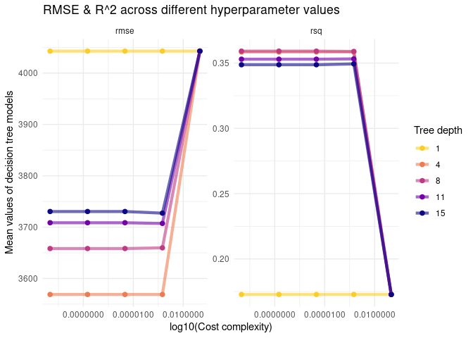
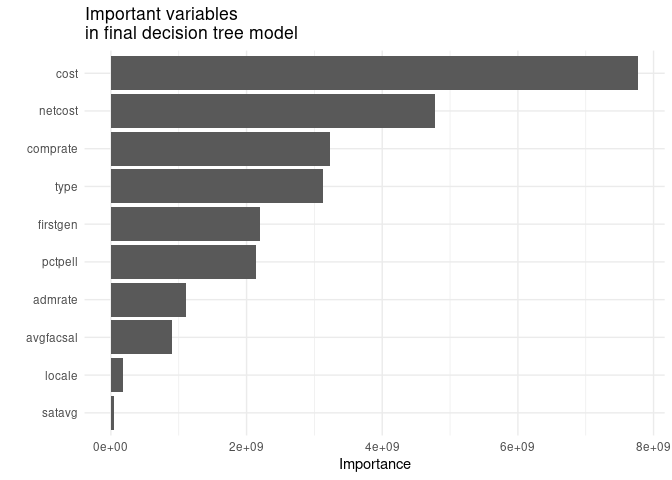

Predicting student debt load
================
Julia Du
2021-02-28

  - [Load necessary libraries](#load-necessary-libraries)
  - [Basic linear model](#basic-linear-model)
  - [Cross-validated linear model](#cross-validated-linear-model)
  - [Tuned decision tree](#tuned-decision-tree)
  - [Conclusion](#conclusion)
  - [Session info](#session-info)

## Load necessary libraries

## Basic linear model

``` r
lm_mod <- linear_reg() %>% 
  set_engine("lm")

debt_rec <- recipe(debt ~ ., data = scorecard) %>% 
  update_role(unitid, name, new_role = "ID") %>%
  step_rm(state, openadmp)

debt_wflow <- workflow() %>%
  add_model(lm_mod) %>%
  add_recipe(debt_rec)

debt_fit <- debt_wflow %>%
  fit(data = scorecard)

predict(object = debt_fit, new_data = scorecard) %>%
  mutate(actual_debt = scorecard$debt) %>%
  rmse(truth = actual_debt, estimate = .pred)
```

    ## # A tibble: 1 x 3
    ##   .metric .estimator .estimate
    ##   <chr>   <chr>          <dbl>
    ## 1 rmse    standard       2992.

Note: for this basic linear model, I could’ve just altered the dataframe
directly to drop my desired variables and used a workflow of model +
formula, rather than model + recipe. I chose to do the latter because
the recipe approach was more intuitive and neater to me.

## Cross-validated linear model

``` r
# adding folds in 
folds_score <- vfold_cv(scorecard, v = 10)

lm_fit_rs <- debt_wflow %>% 
  fit_resamples(folds_score)

lm_fit_rs %>%
  collect_metrics() %>%
  filter(.metric == "rmse")
```

    ## # A tibble: 1 x 6
    ##   .metric .estimator  mean     n std_err .config             
    ##   <chr>   <chr>      <dbl> <int>   <dbl> <chr>               
    ## 1 rmse    standard   3030.    10    98.6 Preprocessor1_Model1

## Tuned decision tree

``` r
# gonna try a tuned model
score_split <- initial_split(scorecard)

score_train <- training(score_split)
score_test <- testing (score_split)

tune_spec <- 
  decision_tree(
    cost_complexity = tune(),
    tree_depth = tune()
  ) %>% 
  set_engine("rpart") %>% 
  set_mode("regression")

tree_grid <- grid_regular(cost_complexity(),
                          tree_depth(),
                          levels = 5)

tree_folds <- vfold_cv(score_train)

tree_wf <- workflow() %>%
  add_model(tune_spec) %>%
  add_recipe(debt_rec)

tree_res <- 
  tree_wf %>% 
  tune_grid(
    resamples = tree_folds,
    grid = tree_grid
    )

tree_res %>%
  collect_metrics() %>%
  filter(.metric == "rmse")
```

    ## # A tibble: 25 x 8
    ##    cost_complexity tree_depth .metric .estimator  mean     n std_err .config    
    ##              <dbl>      <int> <chr>   <chr>      <dbl> <int>   <dbl> <chr>      
    ##  1    0.0000000001          1 rmse    standard   4043.    10    104. Preprocess…
    ##  2    0.0000000178          1 rmse    standard   4043.    10    104. Preprocess…
    ##  3    0.00000316            1 rmse    standard   4043.    10    104. Preprocess…
    ##  4    0.000562              1 rmse    standard   4043.    10    104. Preprocess…
    ##  5    0.1                   1 rmse    standard   4043.    10    104. Preprocess…
    ##  6    0.0000000001          4 rmse    standard   3569.    10    134. Preprocess…
    ##  7    0.0000000178          4 rmse    standard   3569.    10    134. Preprocess…
    ##  8    0.00000316            4 rmse    standard   3569.    10    134. Preprocess…
    ##  9    0.000562              4 rmse    standard   3569.    10    134. Preprocess…
    ## 10    0.1                   4 rmse    standard   4043.    10    104. Preprocess…
    ## # … with 15 more rows

``` r
# graph diff values of hyperparameters
tree_res %>%
  collect_metrics() %>%
  mutate(tree_depth = factor(tree_depth)) %>%
  ggplot(aes(cost_complexity, mean, color = tree_depth)) +
  geom_line(size = 1.5, alpha = 0.6) +
  geom_point(size = 2) +
  facet_wrap(~ .metric, scales = "free") +
  scale_color_viridis_d(option = "plasma", begin = .9, end = 0) +
  scale_x_log10(labels = scales::label_number()) +
  labs(title = "RMSE & R^2 across different hyperparameter values",
       x = "log10(Cost complexity)",
       y = "Mean values of decision tree models",
       color = "Tree depth")
```

<!-- -->

It looks like the decision tree model with a tree depth of 4 and a
log10(cost complexity) extremely close to 0 was the best. This model has
the smallest RMSE (i.e. it has the smallest differences between observed
values and model-predicted values of debt) and the highest R^2
(i.e. more of the variance in debt is explained by the model). In
short, the model fit is best for those parameter values.

``` r
# then choose the best model to finish tuning
best_tree <- tree_res %>%
  select_best("rmse")

best_tree %>%
  select(-.config) %>%
  knitr::kable(
    caption = "Hyperparameter values maximizing accuracy in decision tree model", 
    col.names = c(
      "Complexity parameter",
      "Tree depth"), digits = 10)
```

| Complexity parameter | Tree depth |
| -------------------: | ---------: |
|                1e-10 |          4 |

Hyperparameter values maximizing accuracy in decision tree model

``` r
final_tree_wf <- tree_wf %>%
  finalize_workflow(best_tree)

# fit best model to training data
final_tree <- final_tree_wf %>%
  fit(data = score_train)

# can see how important each var is here
final_tree %>% 
  pull_workflow_fit() %>% 
  vip() +
  labs(title = "Important variables\nin final decision tree model") 
```

<!-- -->

``` r
# last fit & eval of model performance
final_tree_wf %>%
  last_fit(score_split) %>%
  collect_metrics() %>%
  filter(.metric == "rmse")
```

    ## # A tibble: 1 x 4
    ##   .metric .estimator .estimate .config             
    ##   <chr>   <chr>          <dbl> <chr>               
    ## 1 rmse    standard       3489. Preprocessor1_Model1

The importance graph shows which variables are most important in driving
predictions on student loan debt for this model - it definitely makes
sense that cost and netcost would be crucial, though I didn’t expect
completion rate of 1st-time, full-time students to be so important as
well.

## Conclusion

Overall, we saw the smallest RMSE for the basic linear model (2992.32).
When we add in cross-validation to the linear model, we see a slightly
bigger RMSE (3029.57). With the tuned decision tree, we see an even
bigger RMSE (3512.67). This seems to make sense. Without resampling or
tuning, a model can be unrealistically optimistic and seem to explain
data very well - when really the model was overfitting the data we have.

It is interesting that the tuned decision tree did worse than the
cross-validated linear model, so this may be an instance where a
decision tree model just doesn’t work as well as a linear model.
Overall, I’d say that the cross-validated linear model did the best
overall, given its comparatively low RMSE.

## Session info

``` r
devtools::session_info()
```

    ## ─ Session info ───────────────────────────────────────────────────────────────
    ##  setting  value                               
    ##  version  R version 4.0.1 (2020-06-06)        
    ##  os       Red Hat Enterprise Linux 8.3 (Ootpa)
    ##  system   x86_64, linux-gnu                   
    ##  ui       X11                                 
    ##  language (EN)                                
    ##  collate  en_US.UTF-8                         
    ##  ctype    en_US.UTF-8                         
    ##  tz       America/Chicago                     
    ##  date     2021-02-28                          
    ## 
    ## ─ Packages ───────────────────────────────────────────────────────────────────
    ##  package     * version    date       lib source                        
    ##  assertthat    0.2.1      2019-03-21 [2] CRAN (R 4.0.1)                
    ##  backports     1.2.1      2020-12-09 [2] CRAN (R 4.0.1)                
    ##  base64enc     0.1-3      2015-07-28 [2] CRAN (R 4.0.1)                
    ##  broom       * 0.7.3      2020-12-16 [2] CRAN (R 4.0.1)                
    ##  callr         3.5.1      2020-10-13 [2] CRAN (R 4.0.1)                
    ##  cellranger    1.1.0      2016-07-27 [2] CRAN (R 4.0.1)                
    ##  class         7.3-17     2020-04-26 [2] CRAN (R 4.0.1)                
    ##  cli           2.2.0      2020-11-20 [2] CRAN (R 4.0.1)                
    ##  codetools     0.2-16     2018-12-24 [2] CRAN (R 4.0.1)                
    ##  colorspace    2.0-0      2020-11-11 [2] CRAN (R 4.0.1)                
    ##  crayon        1.3.4      2017-09-16 [2] CRAN (R 4.0.1)                
    ##  DBI           1.1.0      2019-12-15 [2] CRAN (R 4.0.1)                
    ##  dbplyr        2.0.0      2020-11-03 [2] CRAN (R 4.0.1)                
    ##  desc          1.2.0      2018-05-01 [2] CRAN (R 4.0.1)                
    ##  devtools      2.3.2      2020-09-18 [1] CRAN (R 4.0.1)                
    ##  dials       * 0.0.9      2020-09-16 [2] CRAN (R 4.0.1)                
    ##  DiceDesign    1.8-1      2019-07-31 [2] CRAN (R 4.0.1)                
    ##  digest        0.6.27     2020-10-24 [2] CRAN (R 4.0.1)                
    ##  dplyr       * 1.0.2      2020-08-18 [2] CRAN (R 4.0.1)                
    ##  ellipsis      0.3.1      2020-05-15 [2] CRAN (R 4.0.1)                
    ##  evaluate      0.14       2019-05-28 [2] CRAN (R 4.0.1)                
    ##  fansi         0.4.1      2020-01-08 [2] CRAN (R 4.0.1)                
    ##  farver        2.0.3      2020-01-16 [2] CRAN (R 4.0.1)                
    ##  forcats     * 0.5.0      2020-03-01 [2] CRAN (R 4.0.1)                
    ##  foreach       1.5.1      2020-10-15 [2] CRAN (R 4.0.1)                
    ##  fs            1.5.0      2020-07-31 [2] CRAN (R 4.0.1)                
    ##  furrr         0.2.1      2020-10-21 [2] CRAN (R 4.0.1)                
    ##  future        1.21.0     2020-12-10 [2] CRAN (R 4.0.1)                
    ##  generics      0.1.0      2020-10-31 [2] CRAN (R 4.0.1)                
    ##  ggplot2     * 3.3.3      2020-12-30 [2] CRAN (R 4.0.1)                
    ##  globals       0.14.0     2020-11-22 [2] CRAN (R 4.0.1)                
    ##  glue          1.4.2      2020-08-27 [2] CRAN (R 4.0.1)                
    ##  gower         0.2.2      2020-06-23 [2] CRAN (R 4.0.1)                
    ##  GPfit         1.0-8      2019-02-08 [2] CRAN (R 4.0.1)                
    ##  gridExtra     2.3        2017-09-09 [2] CRAN (R 4.0.1)                
    ##  gtable        0.3.0      2019-03-25 [2] CRAN (R 4.0.1)                
    ##  hardhat       0.1.5      2020-11-09 [2] CRAN (R 4.0.1)                
    ##  haven         2.3.1      2020-06-01 [2] CRAN (R 4.0.1)                
    ##  highr         0.8        2019-03-20 [2] CRAN (R 4.0.1)                
    ##  hms           0.5.3      2020-01-08 [2] CRAN (R 4.0.1)                
    ##  htmltools     0.5.1.1    2021-01-22 [1] CRAN (R 4.0.1)                
    ##  httr          1.4.2      2020-07-20 [2] CRAN (R 4.0.1)                
    ##  infer       * 0.5.3      2020-07-14 [2] CRAN (R 4.0.1)                
    ##  ipred         0.9-9      2019-04-28 [2] CRAN (R 4.0.1)                
    ##  iterators     1.0.13     2020-10-15 [2] CRAN (R 4.0.1)                
    ##  jsonlite      1.7.2      2020-12-09 [2] CRAN (R 4.0.1)                
    ##  knitr         1.30       2020-09-22 [2] CRAN (R 4.0.1)                
    ##  labeling      0.4.2      2020-10-20 [2] CRAN (R 4.0.1)                
    ##  lattice       0.20-41    2020-04-02 [2] CRAN (R 4.0.1)                
    ##  lava          1.6.8.1    2020-11-04 [2] CRAN (R 4.0.1)                
    ##  lhs           1.1.1      2020-10-05 [2] CRAN (R 4.0.1)                
    ##  lifecycle     0.2.0      2020-03-06 [2] CRAN (R 4.0.1)                
    ##  listenv       0.8.0      2019-12-05 [2] CRAN (R 4.0.1)                
    ##  lubridate   * 1.7.9.2    2020-11-13 [2] CRAN (R 4.0.1)                
    ##  magrittr      2.0.1      2020-11-17 [2] CRAN (R 4.0.1)                
    ##  MASS          7.3-51.6   2020-04-26 [2] CRAN (R 4.0.1)                
    ##  Matrix        1.2-18     2019-11-27 [2] CRAN (R 4.0.1)                
    ##  memoise       1.1.0      2017-04-21 [2] CRAN (R 4.0.1)                
    ##  modeldata   * 0.1.0      2020-10-22 [2] CRAN (R 4.0.1)                
    ##  modelr        0.1.8      2020-05-19 [2] CRAN (R 4.0.1)                
    ##  munsell       0.5.0      2018-06-12 [2] CRAN (R 4.0.1)                
    ##  nnet          7.3-14     2020-04-26 [2] CRAN (R 4.0.1)                
    ##  parallelly    1.22.0     2020-12-13 [2] CRAN (R 4.0.1)                
    ##  parsnip     * 0.1.4      2020-10-27 [2] CRAN (R 4.0.1)                
    ##  pillar        1.4.7      2020-11-20 [2] CRAN (R 4.0.1)                
    ##  pkgbuild      1.2.0      2020-12-15 [2] CRAN (R 4.0.1)                
    ##  pkgconfig     2.0.3      2019-09-22 [2] CRAN (R 4.0.1)                
    ##  pkgload       1.1.0      2020-05-29 [2] CRAN (R 4.0.1)                
    ##  plyr          1.8.6      2020-03-03 [2] CRAN (R 4.0.1)                
    ##  prettyunits   1.1.1      2020-01-24 [2] CRAN (R 4.0.1)                
    ##  pROC          1.16.2     2020-03-19 [2] CRAN (R 4.0.1)                
    ##  processx      3.4.5      2020-11-30 [2] CRAN (R 4.0.1)                
    ##  prodlim       2019.11.13 2019-11-17 [2] CRAN (R 4.0.1)                
    ##  ps            1.5.0      2020-12-05 [2] CRAN (R 4.0.1)                
    ##  purrr       * 0.3.4      2020-04-17 [2] CRAN (R 4.0.1)                
    ##  R6            2.5.0      2020-10-28 [2] CRAN (R 4.0.1)                
    ##  rcfss       * 0.2.1      2021-01-05 [2] Github (uc-cfss/rcfss@36e77a2)
    ##  Rcpp          1.0.5      2020-07-06 [2] CRAN (R 4.0.1)                
    ##  readr       * 1.4.0      2020-10-05 [2] CRAN (R 4.0.1)                
    ##  readxl        1.3.1      2019-03-13 [2] CRAN (R 4.0.1)                
    ##  recipes     * 0.1.15     2020-11-11 [2] CRAN (R 4.0.1)                
    ##  remotes       2.2.0      2020-07-21 [2] CRAN (R 4.0.1)                
    ##  repr          1.1.3      2021-01-21 [1] CRAN (R 4.0.1)                
    ##  reprex        0.3.0      2019-05-16 [1] CRAN (R 4.0.1)                
    ##  rlang       * 0.4.10     2020-12-30 [2] CRAN (R 4.0.1)                
    ##  rmarkdown     2.7        2021-02-19 [1] CRAN (R 4.0.1)                
    ##  rpart       * 4.1-15     2019-04-12 [2] CRAN (R 4.0.1)                
    ##  rprojroot     2.0.2      2020-11-15 [2] CRAN (R 4.0.1)                
    ##  rsample     * 0.0.8      2020-09-23 [2] CRAN (R 4.0.1)                
    ##  rstudioapi    0.13       2020-11-12 [2] CRAN (R 4.0.1)                
    ##  rvest         0.3.6      2020-07-25 [2] CRAN (R 4.0.1)                
    ##  scales      * 1.1.1      2020-05-11 [2] CRAN (R 4.0.1)                
    ##  sessioninfo   1.1.1      2018-11-05 [2] CRAN (R 4.0.1)                
    ##  skimr       * 2.1.2      2020-07-06 [1] CRAN (R 4.0.1)                
    ##  stringi       1.5.3      2020-09-09 [2] CRAN (R 4.0.1)                
    ##  stringr     * 1.4.0      2019-02-10 [2] CRAN (R 4.0.1)                
    ##  survival      3.1-12     2020-04-10 [2] CRAN (R 4.0.1)                
    ##  testthat      3.0.1      2020-12-17 [2] CRAN (R 4.0.1)                
    ##  tibble      * 3.0.4      2020-10-12 [2] CRAN (R 4.0.1)                
    ##  tidymodels  * 0.1.2      2020-11-22 [1] CRAN (R 4.0.1)                
    ##  tidyr       * 1.1.2      2020-08-27 [2] CRAN (R 4.0.1)                
    ##  tidyselect    1.1.0      2020-05-11 [2] CRAN (R 4.0.1)                
    ##  tidyverse   * 1.3.0      2019-11-21 [1] CRAN (R 4.0.1)                
    ##  timeDate      3043.102   2018-02-21 [2] CRAN (R 4.0.1)                
    ##  tune        * 0.1.2      2020-11-17 [2] CRAN (R 4.0.1)                
    ##  usethis       2.0.0      2020-12-10 [1] CRAN (R 4.0.1)                
    ##  utf8          1.1.4      2018-05-24 [2] CRAN (R 4.0.1)                
    ##  vctrs       * 0.3.6      2020-12-17 [2] CRAN (R 4.0.1)                
    ##  vip         * 0.3.2      2020-12-17 [1] CRAN (R 4.0.1)                
    ##  viridisLite   0.3.0      2018-02-01 [2] CRAN (R 4.0.1)                
    ##  withr         2.3.0      2020-09-22 [2] CRAN (R 4.0.1)                
    ##  workflows   * 0.2.1      2020-10-08 [2] CRAN (R 4.0.1)                
    ##  xfun          0.19       2020-10-30 [2] CRAN (R 4.0.1)                
    ##  xml2          1.3.2      2020-04-23 [2] CRAN (R 4.0.1)                
    ##  yaml          2.2.1      2020-02-01 [2] CRAN (R 4.0.1)                
    ##  yardstick   * 0.0.7      2020-07-13 [2] CRAN (R 4.0.1)                
    ## 
    ## [1] /home/duj/R/x86_64-pc-linux-gnu-library/4.0
    ## [2] /opt/R/4.0.1/lib/R/library
